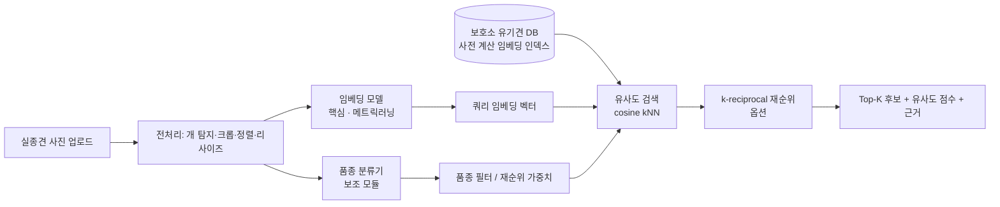

# 구해줘, 가나디 — 프로젝트 기획서 / 설계서

> AI 기반 실종견 찾기 서비스: 보호소 유기견 이미지와 실종견 사진 매칭
> 작성일 2026-09-08 · 문서 버전 v0.1 (초안)

---

## 1. 프로젝트 개요

### 1.1 배경 / 문제
- 매년 다수의 반려견이 실종되고, 보호소에는 신원 미상 유기견이 계속 입소한다.
- 보호자는 여러 보호소 공고를 **눈으로 하나씩** 확인해야 하며, 품종·색상 텍스트 검색만으로는
  같은 개체를 찾기 어렵다.
- 사람 얼굴인식처럼 **개 개체를 시각적으로 재식별(Re-Identification)** 하는 자동 매칭이 필요하다.

### 1.2 서비스 정의
사용자가 잃어버린 반려견 사진 1장을 업로드하면, 보호소 유기견 DB에서
**같은 개체일 가능성이 높은 순서로 Top-K 후보를 제시**하는 검색 서비스.

### 1.3 핵심 목표 (정량)
| 구분 | 목표치 (1차) | 비고 |
|---|---|---|
| Rank-1 정확도 | ≥ 0.55 | Multi-pose Dog test 프로토콜 |
| Rank-5 정확도 | ≥ 0.75 | 실사용은 Top-5 노출 가정 |
| mAP | ≥ 0.45 | |
| 검증(1:1) ROC-AUC | ≥ 0.85 | PetFace verification 프로토콜 |
| 데모 추론 지연 | < 2초 / 쿼리 | M5 맥북, 갤러리 임베딩 캐시 기준 |

### 1.4 핵심 가설
1. 개는 사람 얼굴처럼 **얼굴/무늬/체형의 고유 특징**을 가지며, 메트릭 러닝으로 개체 구분 임베딩을 학습할 수 있다.
2. **품종 정보**를 후보 필터/재순위(re-ranking)에 쓰면 정확도가 오른다.
3. 깨끗한 데이터셋으로 학습한 모델은 **실제 보호소 사진(도메인 차이)** 에서 성능이 하락하며,
   증강·도메인 적응으로 완화할 수 있다. → 실험으로 검증

---

## 2. 문제 유형 정의 (중요)

이 문제는 **분류(classification)가 아니라 검색/재식별(open-set retrieval)** 이다.

- 추론 시점의 실종견·보호소견은 **학습에 없던 새로운 개체**다. 고정된 클래스 수가 없다.
- 따라서 "품종 120종 분류" 같은 접근이 아니라,
  **이미지를 임베딩 벡터로 변환 → 벡터 간 유사도로 랭킹** 하는 구조가 맞다.
- 학습은 **메트릭 러닝**(같은 개는 가깝게, 다른 개는 멀게)으로 한다.
- 품종 분류기는 **보조 모듈**(후보 축소 + 설명가능성)로만 사용한다.

---

## 3. 시스템 아키텍처



### 3.1 모듈별 설계

| 모듈 | 역할 | 1차 구현 | 확장 |
|---|---|---|---|
| **전처리** | 개 영역 탐지·크롭, 리사이즈(224/256), 정규화 | 중앙 크롭 + 리사이즈 | YOLO/Grounding-DINO 개 탐지, 개 얼굴 랜드마크 정렬 |
| **품종 분류기** | 품종 예측(Top-3), 후보 풀 축소·재순위 | timm 백본 + CE 파인튜닝 | 색상/크기 속성 예측 추가 |
| **임베딩 모델** | 개체 식별용 512-d 임베딩 | ResNet50 + BNNeck + CE | ArcFace/Triplet, ViT/DINOv2 |
| **인덱스/검색** | 갤러리 임베딩 저장, cosine Top-K | numpy 행렬곱 | FAISS, 재순위(k-reciprocal) |
| **데모** | 업로드→결과 UI | Streamlit/Gradio | 필터(지역·품종), 피드백 수집 |

---

## 4. 데이터셋 전략

### 4.1 데이터셋별 역할

| 데이터셋 | 라벨 | 역할 | 규모(대략) |
|---|---|---|---|
| **Multi-pose Dog Dataset** | 개체 ID + 카메라 + 포즈 | **핵심 Re-ID 학습·평가** (주 벤치마크) | ~190 ID / 1,650여 장 |
| **PetFace** | 개체 ID (동물 얼굴) | **임베딩 사전학습 / 검증(1:1) 프로토콜** | 대규모 (수천 ID) |
| **Dog Breed Identification (Kaggle)** | 120 품종 | 품종 분류기 학습 (= Stanford Dogs) | ~10k train |
| **Cats and Dogs Breeds (Oxford-IIIT Pet)** | 37 품종 + segmentation | 품종 분류 보조, 개 탐지/크롭 마스크 | ~7,400 장 |
| **Dogs of the World** | 품종 | 품종 분류 데이터 보강, 일반화 테스트 | 소규모 |
| **국가동물보호정보시스템 (animal.go.kr)** | 공고 메타데이터(품종/색상/지역/성별) | **실제 보호소 갤러리 구축 + 도메인 차이 테스트셋 + 데모 DB** | API 수집량에 따름 |

### 4.2 현재 확보 현황 (2026-09-08)
- ✅ `Data/Multi-pose dog dataset/pytorch/` — Market-1501 형식 (`ID_cXsX_seq.jpg`)
  - train 921장 / 95 ID, val 111장, query 104장 / 96 ID, gallery 521장 / 96 ID
  - train ID와 test(query·gallery) ID는 **분리됨** → 올바른 open-set 프로토콜
  - 이미지 크기 제각각(~300px), 배경 포함 → 크롭 전처리 필요
- ⬜ PetFace — 신청/다운로드 필요 (얼굴 crop 형태, 사용 약관 확인)
- ⬜ Kaggle 3종 — 다운로드 필요 (Kaggle API 토큰)
- ⬜ animal.go.kr — 공공데이터포털 오픈API 키 발급 + 수집 스크립트 필요

### 4.3 EDA 계획 (`notebooks/01_eda.ipynb`)
- ID당 이미지 수 분포, 카메라·포즈 커버리지, 이미지 해상도/종횡비 분포
- 품종 데이터 클래스 불균형, 품종 간 시각적 혼동쌍
- animal.go.kr 샘플 vs 학습 데이터: 밝기·해상도·배경·구도 차이 시각화 (도메인 갭 정량화)
- 중복/손상 이미지 필터링

### 4.4 라이선스 / 윤리 주의
- 각 데이터셋 라이선스 표에 정리하고 보고서에 명시 (PetFace는 연구용 약관 확인 필수).
- animal.go.kr 이미지: 공공 목적·출처 표기, 대량 크롤링 아닌 **오픈API** 사용, 개인정보(보호자 연락처 등) 제외.
- 서비스는 "매칭 후보 제시"까지만 — 최종 판단은 사람이 한다는 점을 UI·보고서에 명시.

---

## 5. 모델 설계

### 5.1 임베딩 모델 (핵심)
- **입력**: 224×224 (또는 256×128 Re-ID 관례), ImageNet 정규화
- **백본**: `timm` 사전학습 — 1차 ResNet50, 비교군 EfficientNet-B3 / ViT-S / DINOv2-ViT-S
- **헤드**: GeM pooling → BNNeck → 임베딩 512-d
- **손실**:
  - 1차: ID 분류 Cross-Entropy (+ label smoothing)
  - 2차: + Triplet loss (hard mining) 또는 **ArcFace** 결합
- **증강**: RandomResizedCrop, HorizontalFlip, ColorJitter, RandomErasing, (실사용 대비) 저해상도·블러
- **학습 전략**: 백본 사전학습 고정 1~2 epoch warmup → 전체 파인튜닝, cosine LR, AdamW

### 5.2 품종 분류기 (보조)
- timm 백본 + CE, Stanford Dogs(120) 기준. Top-1/Top-3 정확도 리포트.
- 산출물: 품종 확률 벡터 → 검색 시 같은/유사 품종 후보에 가중치.

### 5.3 검색 / 재순위
- 갤러리 전체 임베딩 사전 계산 → L2 정규화 → cosine 유사도 Top-K
- **재순위 옵션**: k-reciprocal re-ranking, 품종 일치 보너스
- 지표에 각 옵션 on/off 영향 분리 측정

### 5.4 비교 실험 매트릭스 (보고서 핵심 표)

| # | 백본 | 손실 | 사전학습 소스 | 재순위 | 품종필터 |
|---|---|---|---|---|---|
| E0 | ResNet50 | 없음(ImageNet feature) | ImageNet | ✕ | ✕ | ← 베이스라인
| E1 | ResNet50 | CE+BNNeck | ImageNet | ✕ | ✕ |
| E2 | ResNet50 | CE+Triplet | ImageNet | ✕ | ✕ |
| E3 | ResNet50 | CE+ArcFace | ImageNet | ✕ | ✕ |
| E4 | 최고 손실 | 〃 | +PetFace 사전학습 | ✕ | ✕ |
| E5 | EfficientNet-B3 | 최고 손실 | ImageNet | ✕ | ✕ |
| E6 | DINOv2-ViT-S | 최고 손실 | 자기지도 | ✕ | ✕ |
| E7 | 최고 조합 | 〃 | 〃 | ✓ | ✕ |
| E8 | 최고 조합 | 〃 | 〃 | ✓ | ✓ |
| E9 | E8 모델 | 〃 | 〃 | ✓ | ✓ | ← animal.go.kr 도메인 테스트

---

## 6. 평가 설계

### 6.1 지표
- **검색(Re-ID)**: CMC Rank-1 / Rank-5 / Rank-10, mAP
- **검증(1:1)**: ROC-AUC, EER, TAR@FAR=1e-2
- **품종 분류**: Top-1 / Top-3 accuracy, macro-F1

### 6.2 프로토콜
- Multi-pose Dog: 제공된 query/gallery 분할 사용, 같은 (ID, 카메라) 조합 제외 규칙 적용
- PetFace: 공식 verification pair 리스트 (없으면 동일 ID positive / 랜덤 negative 생성, seed 고정)
- animal.go.kr: 소규모 수동 라벨 쌍(같은 개가 복수 사진/공고에 등장하는 케이스) 구축 → 도메인 갭 측정
- 모든 실험 seed 고정, 3-run 평균±표준편차 (여유 없으면 주요 실험만)

### 6.3 정성 분석
- 성공/실패 Top-5 사례 시각화, 실패 원인 분류(포즈·조명·유사 품종·크롭 실패)
- Grad-CAM으로 임베딩이 주목하는 영역 확인

---

## 7. 데모 서비스 설계

- **스택**: Streamlit (또는 Gradio) + 사전 계산된 갤러리 임베딩(`.npy`) + 메타데이터(`.csv`)
- **플로우**: 사진 업로드 → 전처리·임베딩 → Top-5 카드(사진·유사도·품종·보호소 정보·공고일) → "이 개가 맞아요/아니에요" 피드백 버튼
- **갤러리**: animal.go.kr에서 수집한 실제 유기견 공고 N건 (수백~수천)
- **주의 문구**: 참고용 후보 제시, 최종 확인은 보호소 방문/연락 필요
- 배포는 로컬 실행 데모 + 발표 시연 영상. (클라우드 배포는 선택)

---

## 8. 실행 환경 / 기술 스택

- **하드웨어**: MacBook Pro M5 (Apple Silicon)
- **가속**: PyTorch MPS 백엔드 (`torch.device("mps")`). 일부 연산 CPU fallback 가능 →
  `PYTORCH_ENABLE_MPS_FALLBACK=1`. AMP는 제한적이므로 fp32 기준.
- **부하 관리**: 이미지 224px, batch 32~64, ResNet50/EffB3 파인튜닝 3~10 epoch 수준.
  PetFace 전체 대신 서브샘플. 무거운 실험(ViT 대규모)은 Colab 병행 옵션.
- **핵심 라이브러리**: `torch`, `torchvision`, `timm`, `pytorch-metric-learning`,
  `faiss-cpu`(또는 numpy), `scikit-learn`, `albumentations`, `streamlit`, `pandas`, `matplotlib`
- **재현성**: `requirements.txt` 고정, seed 유틸, 실험 설정 YAML + 결과 로그(csv/tensorboard)

---

## 9. 폴더 구조 (제안)

```
DL PROJECT/
├── Data/                     # 원본 데이터 (git 제외)
│   ├── multipose/            #  = Multi-pose dog dataset/pytorch
│   ├── petface/
│   ├── breeds/               # Stanford Dogs, Oxford Pet, Dogs of the World
│   └── shelter/              # animal.go.kr 수집분
├── docs/
│   ├── 00_기획서.md          # (이 문서)
│   ├── 10_데이터카드.md
│   ├── 20_실험로그.md
│   └── report/               # 최종 보고서 원고·그림
├── notebooks/
│   ├── 01_eda.ipynb
│   ├── 02_baseline_retrieval.ipynb
│   └── 03_results_analysis.ipynb
├── src/
│   ├── data/                 # dataset, sampler(PK), transforms
│   ├── models/               # backbone, heads(BNNeck/ArcFace), losses
│   ├── engine/               # train / eval / extract_features
│   ├── retrieval/            # index, rerank, metrics(CMC/mAP)
│   ├── breed/                # 품종 분류기
│   └── utils/                # seed, config, logging
├── scripts/
│   ├── download_kaggle.sh
│   ├── fetch_shelter_api.py  # animal.go.kr 오픈API 수집
│   ├── train_embed.py
│   ├── eval_reid.py
│   └── build_demo_index.py
├── configs/                  # *.yaml 실험 설정
├── app/
│   └── streamlit_app.py
├── requirements.txt
└── README.md
```

---

## 10. 일정 (8주 가정 · 주차별)

| 주차 | 목표 | 산출물 |
|---|---|---|
| **W1** | 기획 확정, 데이터 전량 확보, 라이선스 정리, 레포 스캐폴딩 | 기획서 확정본, 데이터카드, 환경세팅 완료 |
| **W2** | EDA, 전처리 파이프라인, 개 크롭 | `01_eda.ipynb`, 전처리 모듈 |
| **W3** | 베이스라인 E0/E1 (ResNet50 CE+BNNeck), 평가 코드(CMC/mAP) | 베이스라인 수치, `eval_reid.py` |
| **W4** | 손실 비교 E2/E3 (Triplet/ArcFace), 증강 튜닝 | 손실별 성능 표 |
| **W5** | PetFace 사전학습 E4, 백본 비교 E5/E6 | 백본·사전학습 비교 표 |
| **W6** | 품종 분류기, 재순위·품종필터 E7/E8 | 품종 분류 성능, 재순위 효과 표 |
| **W7** | animal.go.kr 수집, 도메인 테스트 E9, 데모 앱 | 도메인 갭 분석, 동작 데모 |
| **W8** | 정성분석(Grad-CAM/실패사례), 보고서·발표자료 완성, 시연영상 | **최종 보고서 + 발표자료 + 데모 영상** |

> 기간이 다르면 W4~W6를 압축(손실은 ArcFace만, 백본 2종만).

---

## 11. 역할 분담 (템플릿 — 팀에서 채우기)

| 영역 | 담당 | 세부 |
|---|---|---|
| 데이터/전처리 | | 수집, EDA, 크롭, 데이터카드 |
| 임베딩 모델 | | 학습 파이프라인, 손실·백본 실험 |
| 검색/평가 | | 인덱스, 재순위, 지표, 실험 로그 |
| 품종 분류·데모 | | 품종 분류기, Streamlit 앱, 시연영상 |
| 문서/발표 | | 보고서 편집, 발표자료, 일정 관리 |

---

## 12. 리스크 및 대응

| 리스크 | 영향 | 대응 |
|---|---|---|
| Multi-pose Dog ID 수가 적어 과적합 | 성능·일반화 | PetFace 사전학습, 강한 증강, 조기종료 |
| 실제 보호소 사진과 도메인 차이 | 실사용 성능 급락 | 저해상도·블러 증강, 도메인 테스트를 별도 지표로 보고(성능 하락 자체가 발견) |
| animal.go.kr API 쿼터·데이터 품질 | 갤러리 규모 | 조기 신청, 품종·기간 나눠 수집, 품질 필터 |
| PetFace 다운로드·약관 지연 | 사전학습 계획 | 대체: Tsinghua Dogs / iNaturalist 개 서브셋으로 사전학습 |
| M5 학습 속도/MPS 연산 미지원 | 실험 횟수 | 이미지·배치 축소, 실험 수 축소, Colab 병행 |
| 팀 일정 지연 | 산출물 완성도 | W3까지 "돌아가는 최소 파이프라인" 우선 확보 후 개선 |

---

## 13. 산출물 체크리스트

### 13.1 최종 보고서 목차(안)
1. 서론 — 문제, 서비스 개요, 기여
2. 관련 연구 — 사람 Re-ID, 동물 생체인식, PetFace/개 Re-ID
3. 데이터 — 데이터셋 6종, 역할, EDA, 전처리, 라이선스
4. 방법 — 문제 정식화, 임베딩 모델, 손실, 품종 모듈, 검색·재순위
5. 실험 — 셋업, 지표, E0~E9 결과 표·그래프(CMC 곡선)
6. 분석 — 정성 사례, Grad-CAM, 도메인 갭, 한계
7. 데모 — 아키텍처, 시연
8. 결론 및 향후 과제
- 부록: 재현 방법, 하이퍼파라미터, 역할 분담

### 13.2 발표자료 구성(안, 12~15장)
문제/서비스(2) → 데이터(2) → 접근 아이디어: 왜 Re-ID(2) → 모델(2) →
실험 결과 핵심 표·CMC(2) → 도메인 테스트·한계(1) → 데모 영상(2) → 결론(1)

---

## 14. 다음 단계 (승인 후 바로 착수)
1. 레포 스캐폴딩 생성 (`src/`, `scripts/`, `configs/`, `requirements.txt`, `.gitignore`)
2. `01_eda.ipynb` — Multi-pose Dog 데이터 EDA
3. 평가 지표 구현(CMC/mAP) + E0 베이스라인(ImageNet feature kNN) 수치 확보
4. Kaggle / PetFace / animal.go.kr 수집 스크립트

> **결정 필요 사항**: ①프로젝트 총 기간(주차) ②팀 인원/역할 ③데모 배포 범위(로컬/클라우드)
> ④PetFace 사용 가능 여부 확인 결과
