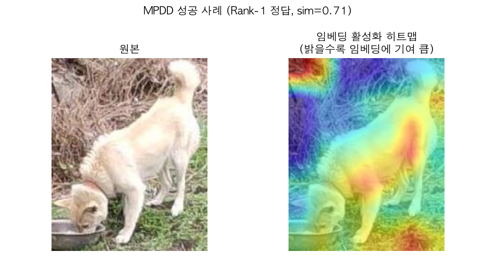
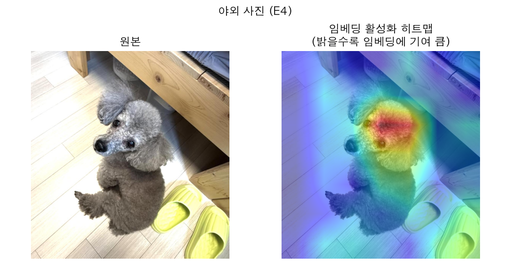
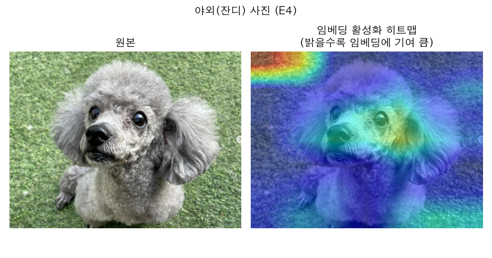

# 정성분석 — 성공/실패 사례와 근본 원인

이 문서는 D5~D8(`01_7일_스프린트_계획.md`)에서 실사용 피드백을 따라간 진단·개선·재진단의
전체 흐름을 정성분석 관점에서 정리한 것이다. 벤치마크 숫자만으로는 안 보이던 문제(배경 편향,
자세 불변성 부족)를 실제 사진으로 재현하고, 활성화 히트맵으로 "모델이 어디를 보는지"까지
확인했다.

## 1. 정량 벤치마크 요약 (모델 반복)

| 모델 | 방법 | MPDD Rank-1/mAP | DogFaceNet Rank-1/mAP |
|---|---|---|---|
| E0 | ImageNet 사전학습 그대로 | (baseline, D2) | (baseline, D2) |
| E1 | ResNet50 + BNNeck + CE 파인튜닝 | 80.8% / 69.2% | 87.4% / 75.6% |
| E2 | Prototypical Network (에피소드 학습) | E0/E1보다 낮음, 미채택 | 〃 |
| E3 | Stanford Dogs 품종분류 사전학습 → E1 이어학습 | 82.7% / 71.1% | 88.5% / 74.5% |
| **E4** | E3 + 배치-하드 Triplet loss (최종 채택) | **87.5% / 72.5%** | 87.1% / **79.3%** |

E4가 전 벤치마크에서 최고 또는 동급 최고. 근거와 각 단계의 실험은 `01_7일_스프린트_계획.md`
D4·D6·D7 참고.

## 2. 성공 사례 — MPDD 도메인 내부

Rank-1 정답을 맞춘 사례(sim=0.71)의 활성화 히트맵. 배경(마른 덤불·잔디)에는 반응이 없고,
**개의 몸통·등 라인에 정확히 집중**한다. 학습 도메인(MPDD/DogFaceNet)과 비슷한 조건의
사진에서는 모델이 의도대로 "개 자체"를 보고 판단하고 있음을 확인.

## 3. 실패 사례 진단 히스토리

### 3.1 문제 제기 (D5)
실사용 중 "Top-5가 완전히 다른 품종/색깔"이라는 피드백. 1차 가설: **배경이 임베딩을
오염시킨다**.

### 3.2 가설 검증 1 — 배경 크롭 (D5.2, 기각)
COCO 사전학습 탐지기로 개 영역만 크롭 후 재학습·재평가. 결과: 보호소 벤치마크(같은 세션)·
MPDD(교차 세션) 둘 다 성능이 오히려 소폭 하락. **원인**: 백본이 배경 포함 이미지로 학습돼서,
추론 시에만 크롭하면 train/test mismatch가 생김. 크롭은 폐기.

### 3.3 실제 사진 재현 — 진짜 도메인 갭 (D6)
사용자의 친구 강아지(회색 푸들, 실내 스마트폰 사진)로 데모를 직접 테스트 → Top-5 전부
믹스견 새끼 사진. 갤러리 내부 품종/색상 일치율은 무작위 대비 9배 높은데(도메인 내부는
정상), 이 도메인 밖 사진에 대해서는 갤러리 전체 유사도가 밋밋하게 깔리고 뚜렷한 스파이크가
없음(최댓값 0.31, 도메인 내부 매칭은 보통 0.6~1.0). **결론**: 학습 데이터(MPDD+DogFaceNet)가
실사용 사진의 도메인(실내조명·스마트폰·미용된 반려견)을 전혀 대표하지 못함.

**대응**: Stanford Dogs(120품종)로 품종 분류 사전학습 → E3.

### 3.4 두 번째 실사진 — 진짜 원인은 둘이었다 (D7)

<table><tr>
<td></td>
<td></td>
</tr></table>

야외(리드줄, 보도블록) 사진으로 재검증 — E3도 여전히 실패. 갤러리에 진짜 "푸들/회색"으로
태그된 개가 있는데도 순위가 2883장 중 1552등까지 밀림(임베딩 유사도 0.089, 사실상 무작위).

색상·임베딩 기여도를 분리 진단해 **두 개의 독립된 원인**을 찾음:

1. **색상 히스토그램 버그**: 채도(S)만 쓰고 밝기(V)를 뺀 설계라 흰색/회색/검정을 구분 못함 →
   H×S×V 3D로 확장(`src/retrieval/color.py`).
2. **더 큰 원인 — identity CE 손실만으로는 자세/조명 불변성이 생기지 않음**: BNNeck 원 논문의
   "ID loss + Triplet loss" 중 Triplet loss를 빠뜨리고 있었음 → 배치-하드 Triplet loss 추가
   (E4).

E4 도입 후 인도어 사진은 **Top-1·2가 정확히 "푸들"**로 개선(위 왼쪽 히트맵: 개 얼굴에 정확히
집중). 그런데 잔디밭 사진(위 오른쪽)의 히트맵을 보면 **왼쪽 위 배경(잔디 텍스처)에 개 얼굴보다
더 강한 활성화 스파이크**가 있다 — 같은 모델인데도 사진에 따라 배경에 흔들리는 정도가
다르다는 뜻. 즉 "배경 편향" 가설이 완전히 틀린 것도, 완전히 맞는 것도 아니었다 — **사진마다
정도가 다른, 일관되지 않은 실패 모드**다.

### 3.5 멀티샷 쿼리로 부분 완화 (D7~D8)
사용자 제안으로 검증: 쿼리 사진 여러 장의 임베딩을 평균하면 자세/조명 편향이 상쇄된다
(DogFaceNet leave-K-out: 1장 Rank-1 87.1%→2장 95.4%→3장부터 포화 95.8%). 데모에 최대 5장
업로드 반영.

실사용자가 회색 푸들 사진 **5장**(배경 제각각: 마루·타일·잔디×2·데크)으로 재검증 —
갤러리의 진짜 매칭견 순위가 1장 쿼리 대비 크게 올랐지만(사진 단위 기준 271등→86등), **개체
단위로 재정렬하면 58등/90등(전체 1,446마리 중)**으로 여전히 Top-10 밖. 업로드한 5장
서로간의 임베딩 유사도가 0.27~0.48에 불과하다는 것도 확인 — **같은 개인데도 자세가 다르면
모델 스스로도 "같은 개"라는 확신이 약하다**는 걸 직접 보여주는 수치.

### 3.6 재학습 없는 빠른 개선 3종 시도 — 전부 효과 없음 (D8)

| 시도 | 결과 |
|---|---|
| 갤러리도 개체당 여러 사진을 평균해 프로토타입화 | 순위 악화 (58→74, 90→265) — 갤러리 사진이 개체당 2장뿐이라 평균이 노이즈를 더함 |
| 품종(푸들)만 필터링해서 후보 축소 | 51마리 중에서도 25등/32등 — 품종을 좁혀도 안 뜸 |
| 임베딩:색상 blend 비율(alpha) 재조정 | 기존 0.75가 오히려 제일 나음 |

품종 필터링까지 무력했다는 게 결정적 증거 — **가중치·필터링 문제가 아니라, "이 개체를 다른
자세·배경 사진에서 재인식하는" 임베딩 자체의 판별력 부족**이 병목이다.

## 4. 종합: 실패 모드 분류

실사진 테스트와 히트맵을 종합하면 최소 두 가지 서로 다른 실패 모드가 섞여 있다.

1. **주의(attention) 실패**: 텍스처가 강한 배경(잔디 등)에 배경 자체가 개 얼굴보다 강하게
   반응하는 경우 (3.4의 잔디 사진). 배경 제거·크롭이 원론적으로는 맞는 방향이지만, 학습 없이
   추론에만 적용하면 D5.2에서 확인했듯 domain mismatch로 역효과.
2. **판별력(discriminative power) 실패**: 개 얼굴/몸통에 정확히 집중하고 있어도(3.4의 인도어
   사진들), 같은 개의 다른 자세·조명 사진끼리 임베딩이 여전히 가깝지 않은 경우. Triplet
   loss(E4)로 일부 개선됐지만 근본적으로는 남아있다 — 자세·조명 다양성을 포괄하는 학습
   데이터(MPDD+DogFaceNet+Stanford Dogs 전부 합쳐도 제한적) 규모의 한계로 보인다.

## 5. 향후 개선 방향 (시간이 더 있다면)

- **1번(주의) 문제**: 크롭된 이미지로 처음부터 재학습(도메인 mismatch 자체를 없앰) — 이번엔
  시간상 시도 못함.
- **2번(판별력) 문제**: PetFinder류 "일상 사진" 데이터셋 추가로 자세·조명 다양성 확보, 또는
  더 강한 augmentation(원근 왜곡, 강한 색상 지터)으로 자세 불변성을 직접 학습 신호에 포함.
- 두 문제 모두 "이 프로젝트 범위의 데이터로 서비스 수준 정확도에 도달하기는 근본적으로 어렵다"는
  현실적 결론과 함께, **멀티샷 업로드 + Top-10 확대**처럼 UX 레벨에서 사용자가 체감하는 실패율을
  낮추는 접근이 현재로선 더 실현 가능한 완화책이라는 것을 보여준다.
